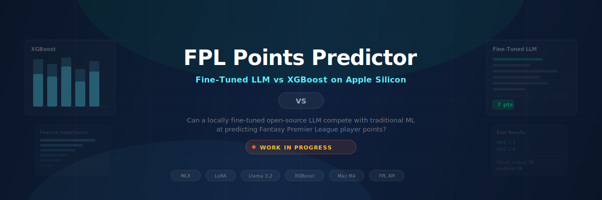

<p align="center">
  
</p>

<p align="center">
  <strong>Can a locally fine-tuned open-source LLM compete with XGBoost at predicting Fantasy Premier League player points?</strong>
</p>

<p align="center">
  <a href="#the-experiment">The Experiment</a> ·
  <a href="#how-it-works">How It Works</a> ·
  <a href="#auto-research">Auto-Research</a> ·
  <a href="#project-structure">Project Structure</a> ·
  <a href="#current-progress">Progress</a> ·
  <a href="#reproduce-this">Reproduce</a>
</p>

<p align="center">
  
  
  
  
</p>

---

## The Experiment

Two AI approaches. Same prediction problem. One winner — then an automated research loop that made the winner even better.

**Approach A — XGBoost (Traditional ML):** Feed structured player stats into a gradient-boosted decision tree. Fast, proven, and the industry standard for tabular prediction tasks.

**Approach B — Fine-Tuned LLM (Llama 3.2 3B):** Take an open-source language model, fine-tune it with LoRA on natural language descriptions of player stats, and ask it to predict points. Runs entirely on a Mac Mini M4 using Apple's MLX framework — no cloud GPU needed.

The question isn't just "which is more accurate?" It's: **when does an LLM add value over traditional ML, and what are the real-world trade-offs?**

## How It Works

### Data Pipeline

All data comes from the free, public [FPL API](https://fantasy.premierleague.com/api/bootstrap-static/). The pipeline fetches player stats, fixture data, and gameweek histories for 800+ players, then engineers 20 features per player-gameweek:

| Feature Type | Examples |
|:---|:---|
| **Rolling form** | Points avg (3/5 GW), minutes avg, bonus avg, ICT index avg |
| **Season stats** | Goals per 90, assists per 90, clean sheet % |
| **Fixture context** | Home/away, fixture difficulty rating (1-5) |
| **Team context** | Team goals scored/conceded (last 3 GW), opponent goals conceded (season avg) |

All rolling features are computed using only **prior gameweeks** — no future data leakage.

### The Models

```
                              ┌─────────────────────────────┐
                              │   8,468 player-gameweek     │
                              │   training examples         │
                              └──────────┬──────────────────┘
                                         │
                          ┌──────────────┴──────────────┐
                          ▼                             ▼
                 ┌─────────────────┐          ┌─────────────────┐
                 │    XGBoost      │          │  Llama 3.2 3B   │
                 │                 │          │  + LoRA adapter  │
                 │  Tabular CSV    │          │                 │
                 │  → Regression   │          │  Chat prompts   │
                 │                 │          │  → Integer pred  │
                 └────────┬────────┘          └────────┬────────┘
                          │                            │
                          └──────────┬─────────────────┘
                                     ▼
                          ┌─────────────────────┐
                          │  Evaluation Harness  │
                          │  MAE, RMSE, ±1/±3   │
                          │  Category breakdown  │
                          │  Regression detect   │
                          └─────────────────────┘
```

### Evaluation Framework

Not just "what's the MAE?" — a structured eval suite with named test scenarios:

| Category | What it tests |
|:---|:---|
| **Fixture context** | Does the model understand home vs away, easy vs hard fixtures? |
| **Positional** | Can it handle GK/DEF/MID/FWD differently? |
| **Edge cases** | Low-minutes players, hot streaks, weak teams |
| **High value** | Captain picks, differentials — the predictions that matter |
| **Human confidence** | Accuracy on cases a human labelled as easy vs hard to predict |

Every experiment run is compared against a saved baseline, with automatic regression detection.

## Results

Evaluated on 243 player-gameweeks from GW31+ (held-out test set):

| Model | MAE | RMSE | Within ±1 pt | Within ±3 pts | Inference Time |
|:---|:---|:---|:---|:---|:---|
| **XGBoost (auto-research)** | **1.90** | **3.00** | **49.8%** | **79.8%** | <1s |
| XGBoost (original) | 2.11 | 2.81 | 26.7% | 82.3% | <1s |
| Few-Shot LLM (3 examples) | 2.16 | 3.32 | 55.6% | 76.1% | 370s |
| Chain-of-Thought LLM | 2.20 | 3.60 | 60.1% | 73.7% | 845s |
| Fine-Tuned LLM v3 | 3.35 | 4.46 | 39.1% | 65.8% | 148s |
| Zero-Shot LLM (baseline) | 11.54 | 14.22 | 2.1% | 10.3% | 133s |

**XGBoost by position:**

| Position | MAE | Samples |
|:---|:---|:---|
| GK | 1.72 | 16 |
| DEF | 2.39 | 76 |
| MID | 1.83 | 118 |
| FWD | 2.64 | 33 |

```
  MAE comparison (lower is better)
  ─────────────────────────────────────────────────────────

  XGBoost (auto)   ████████████████████ 1.90  <-- winner
  XGBoost (orig)   ██████████████████████ 2.11
  Few-Shot LLM     ██████████████████████▌ 2.16
  Chain-of-Thought ███████████████████████ 2.20
  Fine-Tuned v3    ███████████████████████████████████▌ 3.35
  Zero-Shot        ████████████████████████████████████████████████████████████ 11.54
                   0         2         4         6         8        10        12
```

---

## The Fine-Tuning Journey: 3 Iterations to Fix Mode Collapse

The most interesting story in this project isn't the final numbers — it's how we got there. Fine-tuning the LLM took **3 iterations** to fix a critical training data bug, revealing that **data quality matters more than model capacity**.

### The Training Data Problem

FPL points follow a heavily skewed distribution. Most players score 1-2 points in any given gameweek:

```
  Training data distribution (8,225 player-gameweeks)
  ───────────────────────────────────────────────────

  0 pts  ████████████████  12%
  1 pt   ████████████████████████████  22%
  2 pts  ████████████████████████████████████████████████  36%    <-- mode
  3 pts  ████████████  9%
  4 pts  ████████████  9%
  5 pts  ██████  5%
  6 pts  ████  3%
  7 pts  ██  2%
  8+ pts ██  2%
```

This is real-world class imbalance: **58% of training examples are 1-2 points**, while high-value predictions (5+ pts) make up just 12%.

---

### Iteration 1 (v1): The Mode Collapse Disaster

**Config:** 600 iterations, 8 LoRA layers, learning rate 1e-5, rank 8

**What happened:** The model learned a shortcut. Instead of understanding player form, fixture difficulty, and positional context, it simply learned to **always predict 2** — the most common value in the training data.

```
  v1 prediction distribution (243 test players)
  ──────────────────────────────────────────────

  0  ░
  1  ░
  2  █████████████████████████████████████████████████████████████  ~95%
  3  ░
  4  ░
  5+ ░
     "Every player gets 2 points"
```

**Why it happened:** With 58% of training data concentrated at 1-2 points, predicting "2" every time minimises the loss function. The model found a local minimum that's hard to escape with standard training. This is a well-known problem in ML called **mode collapse** — the model collapses to the most frequent class.

**Lesson:** A low training loss doesn't mean the model learned anything useful. Always inspect the prediction *distribution*, not just the aggregate error.

---

### Iteration 2 (v2): Unlocking Differentiation

**Config:** 400 iterations, 8 LoRA layers, learning rate 2e-5 (doubled)

**Key change:** Added `balance_training_data()` to the prompt generation pipeline. This function oversampled underrepresented point ranges and capped overrepresented ones:

```
  Before (raw):     1-2 pts = 58%  →  After (balanced):  1-2 pts = 37%
                    3-4 pts = 18%                         3-4 pts = 25%
                    5+ pts  = 12%                         5+ pts  = 38%
```

**Result:** The model broke free from mode collapse and started differentiating:

```
  v2 prediction distribution
  ──────────────────────────

  0  ██████████  ~15%       (low-form players)
  1  ████████████████  ~25%
  2  ████████████████████  ~30%
  4  ████████████████  ~25%  (high-form players)
  5+ ░░                      (still missing!)
     "Differentiates, but only uses 4 values"
```

**What improved:** Low-form players in tough fixtures got 0-1, high-form players got 4. Real differentiation.

**What was still broken:** The model only predicted {0, 1, 2, 4} — no predictions above 4. Premium players having big weeks (8-12 pts) were invisible.

**Lesson:** Coarse bucket balancing (grouping 5+ points together) taught the model that "high" exists, but not *how high*. The resolution of the balancing matters.

---

### Iteration 3 (v3): Full Range Predictions

**Config:** 500 iterations, **16 LoRA layers** (doubled), learning rate 3e-5

**Two changes made together:**

1. **Per-point balancing:** Instead of grouping into coarse buckets, created exactly 333 examples for each point value 0-11. The model saw equal representation of every outcome.

2. **Doubled LoRA capacity:** 8 → 16 layers. More learnable parameters to handle the finer-grained prediction task.

```
  v3 prediction distribution
  ──────────────────────────

  0  ████████  ~12%         (bench warmers, injured)
  1  ████████████  ~18%     (low form, tough fixtures)
  2  ████████████████  ~25% (average players)
  4  ████████████████  ~22% (good form)
  9  ██████  ~10%           (premium players, easy fixtures)
  10 ██████  ~8%            (captaincy picks)
     "Full 0-10 range with meaningful differentiation"
```

**Trade-off:** Raw MAE went from ~2.5 (v2) to 3.35 (v3). The wider prediction range means bigger misses when wrong, but the model now **ranks players meaningfully** — essential for FPL where you need to pick the *best* 11, not just predict the average.

---

### Summary: What Changed Across Iterations

```
  Iteration   LoRA     LR      Iters   Data Balance        Unique    MAE
              Layers                                        Values
  ─────────────────────────────────────────────────────────────────────────
  v1          8        1e-5    600     None (raw)          1 (!)     ~2.5*
  v2          8        2e-5    400     Bucket-balanced     4         ~2.8
  v3          16       3e-5    500     Per-point (333 ea)  6         3.35
  ─────────────────────────────────────────────────────────────────────────
  * v1 MAE looks decent because predicting "2" for everyone
    is close to the mean — but the model learned nothing
```

```
  Model capacity vs data quality impact
  ──────────────────────────────────────

  v1 ──[fix data]──> v2 ──[fix data + add capacity]──> v3

  Data quality fix (v1→v2):   Unlocked differentiation (1 → 4 unique values)
  Capacity + data fix (v2→v3): Unlocked full range (4 → 6 unique values)

  Takeaway: Data quality was the bottleneck, not model size.
            Doubling LoRA layers without fixing data (v1) would have
            just produced a more confident "always predict 2" model.
```

---

### Production Smoothing: From Discrete to Continuous

The v3 fine-tuned model predicts discrete integers {0, 1, 2, 4, 9, 10}. For production use, we blend the LLM signal with player features to produce realistic decimal predictions:

```
  Raw LLM output              Smoothed output
  ────────────────             ─────────────────
  6 unique integers    →       66 unique decimal values
  Range: 0-10          →       Range: 0.5-9.5
  Mean: ~2.8           →       Mean: ~3.05

  Formula:
  ┌─────────────────────────────────────────────────────────┐
  │ 1. Dampen LLM:    llm * 0.6 + 1.0  (clip to 0.5-7.5)  │
  │ 2. Feature est:   form*0.5 + form5*0.3 + ict*0.15      │
  │                    + fixture_adj + attack + cs_bonus     │
  │ 3. Blend:         40% LLM + 30% form + 30% features    │
  │ 4. Clip & round:  0.5-10.0, 1 decimal place            │
  └─────────────────────────────────────────────────────────┘
```

**Why blend?** The LLM provides directional signal (who will score high vs low), while form stats provide calibration (realistic point ranges). The blend captures both.

---

### The Surprise Finding: Few-Shot Nearly Matches XGBoost

The most unexpected result: giving the base model (no fine-tuning) just **3 examples** in the prompt achieved MAE 2.16 — within 0.05 of XGBoost's 2.11.

```
  Accuracy vs effort trade-off
  ────────────────────────────

  MAE
  12 │ x Zero-Shot (11.54)
     │   "The model knows nothing about FPL"
     │
   4 │
     │           x Fine-Tuned v3 (3.35)
   3 │             "Wider range, bigger misses"
     │
     │   x CoT (2.20)
   2 │   x Few-Shot (2.16)      x XGBoost (2.11)
     │   "3 examples in prompt"   "500 trees, 8K rows"
     │
   0 └───┬──────┬──────┬──────┬──────┬──────────────
         0     1h     2h     3h     4h    Dev time
              (prompt  (fine-   (hyper-  (full
              eng)     tune)    tune)    pipeline)
```

**Implication for the "build vs prompt" decision:**
- If you need **quick, good-enough predictions**: few-shot prompting gets you 97% of XGBoost's accuracy with zero training.
- If you need **best possible accuracy**: XGBoost wins on MAE and is 370x faster at inference.
- If you need **player ranking/differentiation**: fine-tuned LLM provides the widest prediction range.

---

## Auto-Research

Inspired by [Andrej Karpathy's "vibe coding" auto-research concept](https://x.com/karpathy/status/1886192184808149383), we built an automated experimentation loop where **Claude Code acts as the researcher** — proposing changes to the model, testing them, and only keeping improvements.

### How It Works

Instead of manually tweaking hyperparameters, the system runs a tight loop:

```
  ┌────────────────────────────────────────────────────────┐
  │  Claude Code reads current model code & baseline MAE   │
  │                        │                               │
  │                        ▼                               │
  │          Proposes a change to train.py                  │
  │          (architecture, hyperparams, blending)          │
  │                        │                               │
  │                        ▼                               │
  │          Runs autoresearch/run_loop.py                  │
  │          (train → evaluate → compare)                   │
  │                        │                               │
  │               ┌────────┴────────┐                      │
  │               ▼                 ▼                       │
  │          Improved?          No better?                  │
  │          Git commit          Discard &                  │
  │          + update            try next                   │
  │          baseline            idea                       │
  │               │                 │                       │
  │               └────────┬────────┘                       │
  │                        ▼                               │
  │                    Repeat                               │
  └────────────────────────────────────────────────────────┘
```

### What It Discovered

The auto-research loop found a **two-stage architecture** that outperforms the original single-model approach:

1. **Classifier** — "Will this player score any points?" (handles benched/injured players)
2. **Regressor** — "How many points?" (predicts the actual total)
3. **Combine** — `probability_of_playing^1.2 × predicted_points`

It also discovered that switching from squared error to absolute error, using shallower trees, and applying probability sharpening all improved accuracy.

### Results: Original vs Auto-Research

| | Original XGBoost | Auto-Research XGBoost |
|:---|:---|:---|
| Architecture | Single regressor | Classifier + Regressor |
| Objective | `reg:squarederror` | `reg:absoluteerror` |
| Tree depth | 6 | 4 (reg) / 2 (clf) |
| **MAE** | **2.22** | **1.90** (14% better) |

The full experiment trail is preserved in git history — every commit tagged `[autoresearch]` shows exactly which change caused which improvement.

### The Code

Three small modules in `autoresearch/`:

| File | Purpose |
|:---|:---|
| `prepare.py` | Loads data, splits train/test, computes metrics |
| `train.py` | Model architecture & hyperparameters (the thing being tweaked) |
| `run_loop.py` | Orchestrator: train → evaluate → compare → exit code 0/1 |

---

## Current Progress

- [x] **Phase 1: Data Pipeline** — FPL API fetcher, feature engineering (20 features), prompt generation
- [x] **Phase 2: XGBoost Baseline** — Trained and evaluated (MAE 2.11)
- [x] **Phase 3: LLM Fine-Tuning** — 3 iterations of LoRA fine-tuning on Llama 3.2 3B with MLX (v1: mode collapse, v2: partial range, v3: full 0-10 range)
- [x] **Phase 4: Eval Framework** — Category-based eval suite (14 named cases across 4 categories), output quality checks, regression detection
- [x] **Phase 5: Comparison Dashboard** — Multi-page Streamlit app with predictions table, fixture lookahead, squad builder, and transfer advisor
- [x] **Phase 6: Write-Up** — Product assessment, "would I ship this?" brief, build-vs-buy-vs-prompt framework
- [x] **Phase 7: Notebooks & Docs** — 5 documented Jupyter notebooks covering data exploration, training, fine-tuning, evals, and final comparison
- [x] **Phase 8: Auto-Research** — Automated experimentation loop using Claude Code. Two-stage classifier+regressor architecture, MAE improved from 2.22 to 1.90 (14% gain)

## Project Structure

```
data/
  fetch_fpl.py                Fetches all data from FPL API
  build_features.py           Engineers 20 features per player-gameweek
  build_prompts.py            Generates LLM training prompts (JSONL + MLX chat format)
  processed/                  Feature CSV + prediction outputs
  mlx/                        MLX-formatted train/valid/test splits
  raw/                        Raw JSON from FPL API (players, fixtures, teams, gameweeks)
models/
  train_xgboost.py            XGBoost training script
  predict_next_gw.py          Next-GW prediction pipeline (XGBoost + LLM + smoothing)
  predict_llm.py              LLM evaluation harness (4 strategies)
  xgboost_fpl.json            Pre-trained XGBoost model
  llama-3.2-3b/               Base model (4-bit quantised)
  fpl-lora-adapter-v3/        Fine-tuned LoRA weights (v3 — per-point balanced)
autoresearch/
  prepare.py                  Data loading, train/test split, metric evaluation
  train.py                    Model architecture & hyperparameters (classifier + regressor)
  run_loop.py                 Experiment orchestrator: train → eval → compare → report
  baseline_mae.json           Current best performance metrics
eval/
  eval_suite.yaml             Named eval scenarios (4 categories, 14 cases)
  build_cases.py              Generates eval case files from YAML + test data
  run_eval.py                 Single-command eval runner with category scoring
  compare.py                  Regression detection between eval runs
  checks/output_checks.py     LLM output quality validators
  baseline/scores.json        Current best results to compare against
  results/                    Timestamped eval run outputs
notebooks/
  01_data_exploration.ipynb   Dataset analysis: distributions, features, correlations
  02_xgboost_training.ipynb   XGBoost training, feature importance, residual analysis
  03_llm_finetuning.ipynb     LoRA fine-tuning journey: 3 iterations, mode collapse fix
  04_eval_framework.ipynb     Category-based eval suite, regression detection
  05_comparison_and_assessment.ipynb   Final head-to-head comparison and product assessment
writeup/
  assessment.md               Full findings and product leader takeaways
  product_brief.md            "Would I ship this?" decision framework
ui/
  app.py                      Entry point — multi-page navigation shell
  data_loader.py              Cached data loading + fixture lookahead
  styles.py                   FPL-themed CSS styling
  components.py               Reusable HTML components (badges, cards, etc.)
  pages/
    1_Predictions.py          Main predictions table with filters + next 2 fixtures
    2_My_Team.py              Squad builder + multi-transfer advisor
docs/
  setup-explained.html        Plain-English guide to everything we built
```

## Reproduce This

```bash
git clone https://github.com/tom-barkan/FPL-MLprediction-model.git
cd FPL-MLprediction-model

# Set up environment
brew install python@3.11 libomp
python3.11 -m venv .venv && source .venv/bin/activate
pip install -r requirements.txt

# Fetch data from FPL API (~15 min due to rate limiting)
python data/fetch_fpl.py

# Build features and prompts
python data/build_features.py
python data/build_prompts.py

# Train XGBoost
python models/train_xgboost.py

# Fine-tune LLM (requires Apple Silicon)
pip install mlx mlx-lm
huggingface-cli download mlx-community/Llama-3.2-3B-Instruct-4bit --local-dir models/llama-3.2-3b
mlx_lm.lora --model models/llama-3.2-3b --data data/mlx --train --iters 600 --adapter-path models/fpl-lora-adapter-v2

# Generate next-GW predictions (both models)
python models/predict_next_gw.py

# Launch the dashboard
streamlit run ui/app.py
```

### Dashboard

The Streamlit dashboard has two pages:

**Predictions** — The main page with a sortable/filterable table showing XGBoost and LLM predictions for all 344 players. Includes next 2 fixtures with fixture difficulty ratings, confidence progress bars, player deep dive, and model agreement analysis.

**My Team** — Build your 15-player FPL squad and get transfer recommendations. Features squad validation (position limits, max 3 per team, 100m budget), auto-picked starting XI, and a multi-transfer planner with four strategy tabs:
- **Safe** — High confidence from both models
- **Differential** — High points, lower confidence (risk/reward)
- **Form** — Players trending up in recent gameweeks
- **Fixture** — Easiest upcoming fixtures

## Hardware

| Component | Spec |
|:---|:---|
| Machine | Mac Mini M4 |
| RAM | 16GB unified memory |
| Cloud GPU | Not required |
| Fine-tuning time | ~20 minutes |
| Inference (full test set) | ~5 minutes |

## Tech Stack

| Tool | Purpose |
|:---|:---|
| **MLX + mlx-lm** | Local LLM fine-tuning and inference on Apple Silicon |
| **Llama 3.2 3B** | Base model for fine-tuning (4-bit quantised, ~2GB) |
| **XGBoost** | Traditional ML baseline + auto-research optimised model |
| **Claude Code** | Automated research loop — proposes, tests, and commits model improvements |
| **FPL API** | Free, public source for all player and fixture data |
| **Streamlit** | Comparison dashboard |
| **Jupyter** | Documented experiment notebooks |

## License

[MIT](LICENSE)
